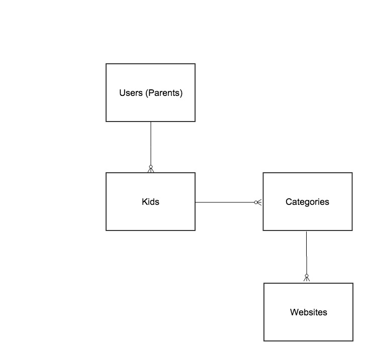

##Project 2 - World Wide Kid
World Wide Kid (WWK) a website that enables parents with kids ages 2-10 to manage and support their children's web activity across any device and location.  Parents of young children face the problem of forgetting what wesbites are useful or fun (yet appropriate for their children).

Parents endlessly bookmark websites for their children but bookmark management is never a priority so a browser ends up with a surplus of websites in a single list that hold different websites targeted for multiple children in their family.

WWK is about easy and universal access to the websites that you, as a parent, want to put in front of your childern (whether you'r at home, on the go or at grandma's house on her Dell computer).  All parents of young children desprately seek tools to make their lives simpler. WWK does that.

### How the Website works 

####For a Parent

A parent will create a family account, establishing personal login credentials.  The parent will do the following in her account: 

2. Create a kid or multiple kid	 pages
3. For each kid, establish the categories of various website that will be available for that kid (Note: at different times, parents wants their kids to focus on different activities...e.g. educational activities vs fun stuff).
3. Populate the kid pages with specific URLs within the categories that will appear for each Kid.  There will be a set number of URL spots within each category (e.g. 6 spots). 

####For a Kid

Following parental login and setup, a kid will be able to do the following: 

1. Find his page on the list of kid pages in the family,
2. Click through to see all of the websites that are available to him at that moment
3. Choose the website they want to visit
4. Choose a back option to leave a single website and move back to their main kid page with all of their websites...or have the other options that weren't chosen as very small icons on the border of the page so the child can easily access a different page within their options of websites.

#### Kid Website Pages

A kid page will have a smaller view of all of the allowable websites that are in his page.  This will be achieved by real-time links seen through iframes.  When a single website option is chosen, that page will populate the full kid screen.  Below is a mock-up of the category page with available options for the kid. 

#### Models Diagram 

#### Models Details:

Users (Parents): name, email, password  
Kids: name, gender, age:integer, user:references    
Websites: name url:text kid:references

### Steps to build

* Set up Rails app with 4 models
	* Connect all models
	* Via console - input data and see if data models work
	* Build routes, new and show pages to test all basic functionality
	* Build permissions/authentication for parent logins and access
	* Set-up bootstrap links in files
* Figure out iframe presentation of URLs
* Style pages with bootstrap
* Look for partial cleanups
* Look at upgrade features
* Clean up readme and make website linkable at guthub project page

### Wednesday 

* Get add and showing websites to fully work 
* Organize flow with links
* Create child viewing pages with iframe 
* config.action_dispatch.default_headers = {
    'X-Frame-Options' => 'ALLOWALL'
}
* Styling

### Pages Needed

1. Index-homepage that desribes value and functionality
2. New account set-up
3. Exisitng account login
4. Parent admin access
5. Kid access of a the mutiple URL display
6. Kid access to the URL that was chosen

#### Features/upgrades for future versions of the website

* Allow kids to request new websites in their allowable website options
* Via a join table (kidswebsites) allow the same website to be assigned to multiple kids
* Do I want pre-established Categories in a drop-down from which to choose instead of allowing a user to create from scratch?  Maybe some defines with an other option.
* Invite other parents to view your children's website lineups
* Suggested websites for specific ages/genders
* Top websites 
* Sponsored links from which to choose

 
 

