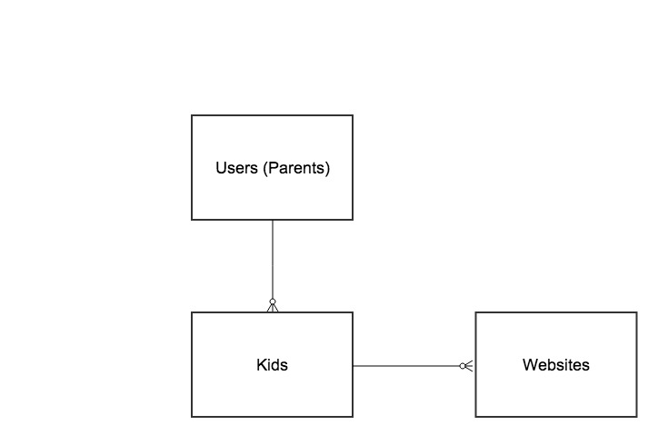

##Project 2 - World Wide Kid
World Wide Kid (WWK) a website that enables parents with kids ages 2-10 to manage and support their children's web activity across any device and location.  Parents of young children face the problem of forgetting what wesbites are useful or fun (yet appropriate for their children).

Parents endlessly bookmark websites for their children but bookmark management is never a priority so a browser ends up with a surplus of websites in a single list that hold different websites targeted for multiple children in their family.

WWK is about easy and universal access to the websites that you, as a parent, want to put in front of your childern (whether you'r at home, on the go or at grandma's house on her Dell computer).  All parents of young children desprately seek tools to make their lives simpler. WWK does that.

### How the Website works 

####For a Parent

A parent will create a family account, establishing personal login credentials.  The parent will do the following: 

1. Create a secure account
2. Create a kid or multiple kid pages within the account
3. Populate the kid pages with specific URLs 

####For a Kid

Following parental login and setup, a kid will be able to do the following: 

1. Find his page on the list of kid pages in the family
2. Scroll through to see all of the websites that are available to him at that moment
3. Choose the website they want to visit
4. Choose back to leave a single website and move back to their main kid page with all of their websites  

#### Kid Website Pages

A kid page will have a smaller view of all of the allowable websites that are in his page.  This will be achieved by real-time links seen through iframes.  When a single website option is chosen, that page will populate the full kid screen.  Below is a mock-up of the category page with available options for the kid. 

#### Models Diagram 

#### Models Details:

Users (Parents): name, email, password  
Kids: name, age:integer, user:references    
Websites: name url:text kid:references user:references

#### Features/upgrades for future versions of the website

* Allow kids to request new websites in their allowable website options
* Via a join table (kidswebsites) allow the same website to be assigned to multiple kids
* Invite other parents to view your children's website lineups
* Suggested websites for specific ages/genders
* Top websites 
* Sponsored links from which to choose

 
 

